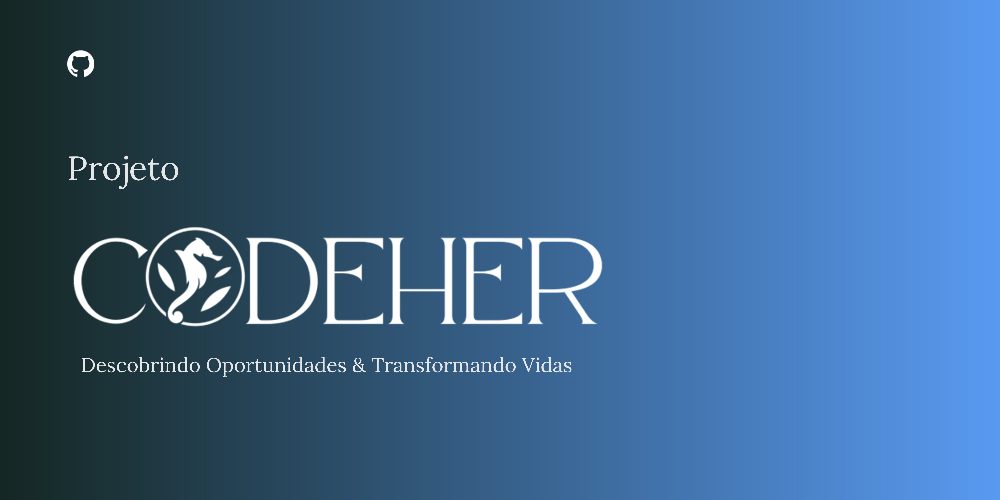

# Codeher: Descobrindo Oportunidades & Transformando Vidas

## Descrição
Codeher é um site que oferece oportunidades de trabalho voluntário em tecnologia exclusivamente para mulheres, com o objetivo de fomentar a participação feminina no setor de tecnologia e criar um ambiente mais inclusivo e diversificado.

## Nosso Compromisso
Nosso compromisso é capacitar mulheres e proporcionar oportunidades reais de aprendizado e crescimento na área de tecnologia. Acreditamos no poder da comunidade e da colaboração para transformar vidas. A Codeher se dedica a oferecer um ambiente acolhedor e de suporte, onde cada mulher pode descobrir e desenvolver suas habilidades, contribuindo para o seu crescimento pessoal e profissional.

## Público-Alvo
Nosso público-alvo é composto por mulheres que desejam migrar de carreira ou jovens mulheres que querem começar a atuar na área de tecnologia. Queremos proporcionar a essas mulheres a oportunidade de aprender, colaborar e crescer em um ambiente que apoia sua jornada e aspirações na tecnologia.

## Estilo Visual
O estilo visual da Codeher é pensado para ser moderno e relaxante, trazendo uma combinação de cores em tons de azul, branco e rosa. A logo é um majestoso cavalo-marinho, simbolizando a força, resiliência e adaptação das mulheres que navegam nas águas da tecnologia. Assim como o cavalo-marinho, acreditamos que as mulheres têm a capacidade de se adaptar e prosperar, mesmo nos ambientes mais desafiadores.

## Estrutura do Projeto
O projeto Codeher é organizado em várias páginas, cada uma com uma função específica:

- **Home**: Incentiva as mulheres a se envolverem com o trabalho voluntário, destacando as vantagens e impactos dessa escolha.
- **Oportunidade de Voluntariado**: Página dedicada à listagem de vagas disponíveis para voluntariado.
- **Candidate-se a Vaga**: Um formulário simples e direto para as mulheres se inscreverem nas oportunidades de voluntariado.
- **Contate-nos**: Página com informações de contato e referências, facilitando a comunicação com a equipe Codeher.
- **Sobre Nós**: Um espaço para contar um pouco da história da Codeher e apresentar nossos parceiros.

## Recursos Utilizados
O site Codeher foi desenvolvido utilizando a plataforma WordPress, uma ferramenta poderosa para criação e gerenciamento de sites. O WordPress permite uma personalização flexível e uma interface amigável, tornando-se uma escolha ideal para o desenvolvimento de sites que necessitam de atualização constante e fácil gerenciamento de conteúdo.

## Conclusão
Codeher é mais do que um site; é uma comunidade onde as mulheres encontram oportunidades de aprendizado, colaboração e crescimento. Através do trabalho voluntário em tecnologia, estamos descobrindo talentos e transformando vidas, uma mulher de cada vez.

## Como Contribuir
1. Faça um fork do repositório.
2. Clone o seu fork: `git clone https://github.com/Maysa502/Codeher.git`
3. Crie uma branch para sua modificação: `git checkout -b minha-modificacao`
4. Faça o commit das suas alterações: `git commit -am 'Adiciona nova funcionalidade'`
5. Faça o push para a branch: `git push origin minha-modificacao`
6. Envie um pull request.

## Equipe
- [Chris Domingos](https://github.com/Christopher040904)
- [Maysa Arruda](https://github.com/Maysa502)

## Parceiros
- [TechHer](https://github.com/agessicamilla/techher)

---

### "Codeher: Descobrindo oportunidades e transformando vidas."

---

